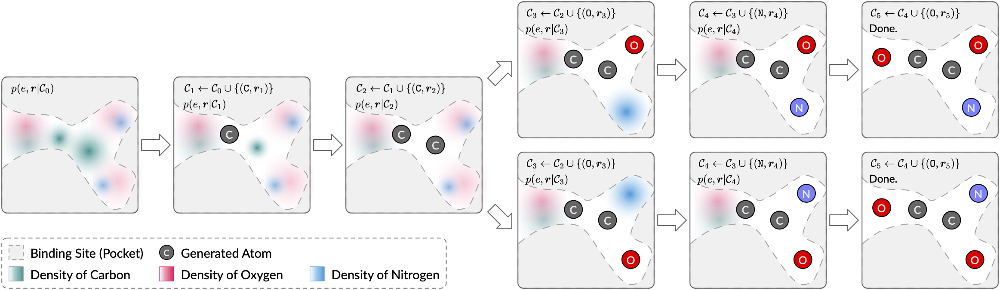

# A 3D Generative Model for Structure-Based Drug Design



[[Paper](https://arxiv.org/abs/2203.10446)]
[[Slides](https://drive.google.com/file/d/1PnypgrWqZAnaONy_Ccq-fmTDo4IRJpX1/view?usp=sharing)]

## Installation

### Dependency

The code has been tested in the following environment:

| Package           | Version   |
|-|-|
| Python            | 3.8.12    |
| PyTorch           | 1.10.1    |
| CUDA              | 11.3.1    |
| PyTorch Geometric | 2.0.3     |
| RDKit             | 2020.09.5 |
| OpenBabel         | 3.1.0     |
| BioPython         | 1.79      |

### Install via Conda YML FIle (CUDA 11.3)
```bash
conda env create -f env_cuda113.yml
conda activate SBDD-3D
```

### Install Manually
```bash
conda create --name SBDD-3D python=3.8
conda activate SBDD-3D

conda install pytorch=1.10.1 torchvision torchaudio cudatoolkit=11.3 -c pytorch
conda install pyg -c pyg -c conda-forge
conda install easydict -c conda-forge
conda install biopython -c conda-forge
conda install rdkit openbabel python-lmdb -c conda-forge
conda install tensorboard -c conda-forge
```

## Datasets

Please refer to [`README.md`](./data/README.md) in the `data` folder.

## Sampling

### Sampling for Pockets in the Testset
To sample molecules for the i-th pocket in the testset, please first download the trained models following 
[`README.md`](./pretrained/README.md) in the `pretrained` folder. Then, run the following command:
```bash
python sample.py ./configs/sample.yml --data_id {i}  # Replace {i} with the index of the data. i is between 0 and 99 for the testset.
```

### Sampling for PDB Structures

To generate ligands for your own pocket, you need to provide the `PDB` structure file of the protein, the center coordinate of the pocket bounding box, and optionally the side length of the bounding box (default: 22Å).

Example:
```bash
python sample_for_pdb.py \
    --pdb_path ./example/4yhj.pdb \
    --center 32.0,28.0,36.0
```


## Training
:construction: **Work in progress...**


## Citation

```
@inproceedings{luo2021sbdd,
    title={A 3D Generative Model for Structure-Based Drug Design},
    author={Shitong Luo and Jiaqi Guan and Jianzhu Ma and Jian Peng},
    booktitle={Thirty-Fifth Conference on Neural Information Processing Systems},
    year={2021}
}
```
